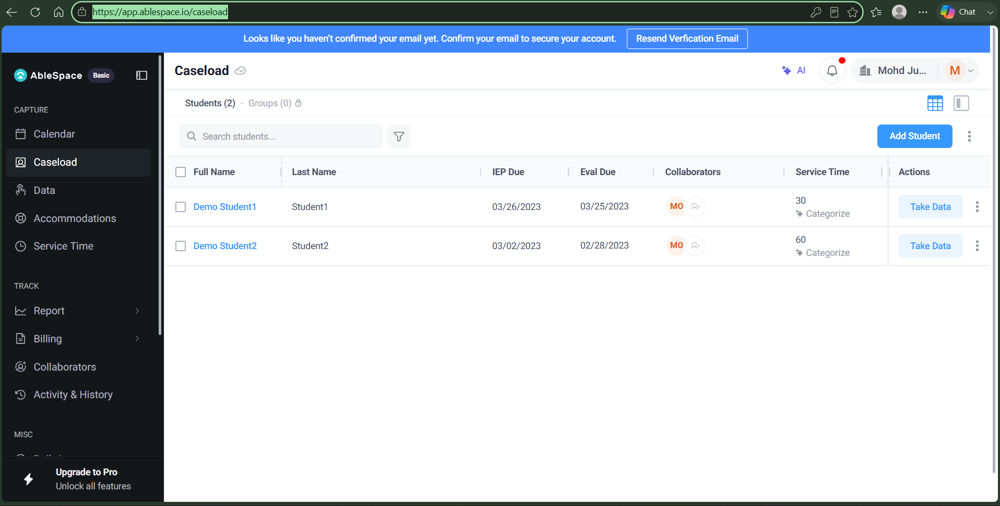
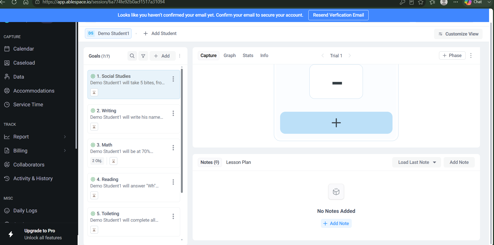
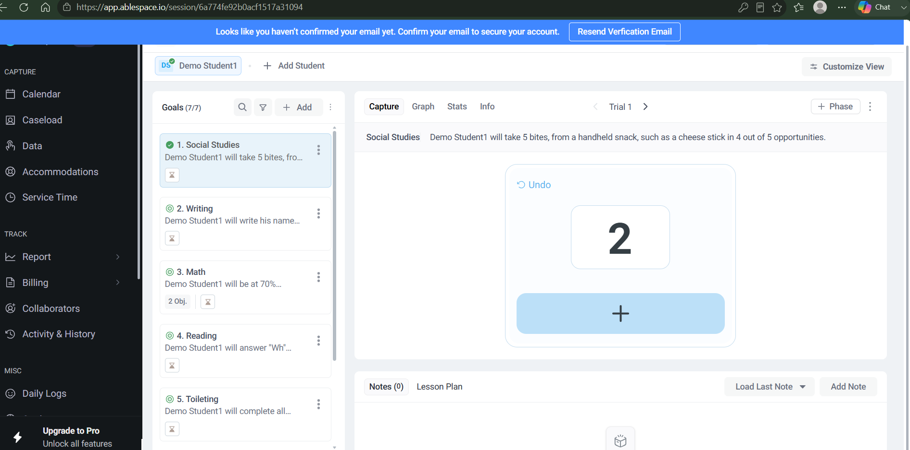
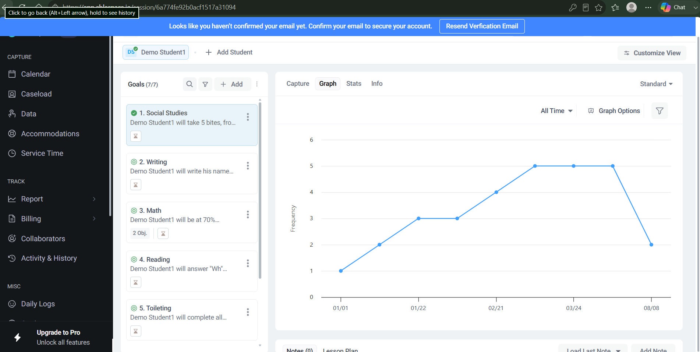

# Part 2 — Product Understanding: Caseload → Take Data

## 1. Entry Point

The workflow starts on the **Caseload** screen (left nav, under "Capture"). It's a table of every student assigned to the provider, with columns for Full Name, Last Name, IEP Due date, Eval Due date, Collaborators (avatar stack with an "add collaborator" affordance), and Service Time (e.g. "30 min/wk", with a "Categorize" sub-link). Each row ends with a **Take Data** button plus an overflow (⋮) menu for other row-level actions.

This table is really a triage view — the IEP/Eval due dates and service time let a provider scan their whole caseload and see who needs attention soon, before deciding whose data to capture right now.

## 2. Workflow — Step by Step

**Step 1 — Click "Take Data" on a student row.**
This navigates to a dedicated session URL (`/session/{sessionId}`) scoped to that one student. The header shows the student's initials/avatar and name ("Demo Student1"), a shortcut to add another student to the same session, and a "Customize View" control.

**Step 2 — Pick a goal from the left rail.**
The student's IEP goals are listed as cards ("Goals (7/7)"), each showing the goal title (Social Studies, Writing, Math, Reading, Toileting, …), a truncated one-line summary of the goal text, and a small icon (looks like a graph/chart shortcut). Goals with sub-objectives show an "Obj." count (Math shows "2 Obj."). Clicking a goal card selects it and loads it into the capture panel on the right; the selected card is visually highlighted and gets a green checkmark once data exists for it.

**Step 3 — Capture data against the selected goal.**

The right panel has four tabs: **Capture / Graph / Stats / Info**. On Capture, the full goal text is shown as the header (e.g. *"Demo Student1 will take 5 bites, from a handheld snack, such as a cheese stick in 4 out of 5 opportunities"*), so the provider has the exact criteria in view while recording. Below that sits a **Trial** stepper ("Trial 1" with ‹ › arrows to move between trials) and a "+ Phase" button for phase changes.

The actual data-entry control is a large card with a big central **"+" button**. Before any taps, it shows a blank dash.

Tapping "+" increments a running count (1, 2, 3…), and once at least one tap is logged, an **"Undo"** link appears above the number to reverse the last entry — visible here at "2" after two taps.

**Step 4 — Add context (optional).**
Below the capture card is a Notes section ("Notes (0)" / "Lesson Plan" tabs, "Load Last Note" and "Add Note" buttons). It's empty by default ("No Notes Added") — notes are opt-in, not required to log a trial.

**Step 5 — Data rolls up automatically.**

Switching to the **Graph** tab for that same goal shows a line chart (x-axis: dates from the first recorded session through today, y-axis: "Frequency") with the counter values plotted as connected points. There's an "All Time" date-range dropdown, a "Graph Options" control, and a "Standard" view-type dropdown — so the single number tapped in on the Capture tab immediately becomes a trend the provider (and presumably IEP team) can read at a glance. Presumably Stats gives a numeric/statistical summary of the same data, and Info shows the goal's metadata.

## 3. Supporting Context Visible in the Caseload Table

The IEP Due / Eval Due columns tell a provider when documentation deadlines are approaching for a student, independent of how recently data was captured — so a student can have current data collection but still be flagged if their IEP/Eval date is close. Service Time (e.g. "30 Mins/Week") is the contracted minutes a student is owed; combined with the caseload count, it's what a provider would use to plan how much of their week needs to go to Take Data sessions versus other work.

## 4. UX/UI Improvements Identified

- **Issue:** The capture card's "+" counter has no visible context for what's being counted against — the goal text mentions "4 out of 5 opportunities," but the trial counter itself doesn't show progress toward that target (e.g., "2 of 5").
  **Why it matters:** the provider has to mentally track progress against the goal's own criteria instead of seeing it reflected live in the tool they're using to record it.
  **Fix:** surface the target denominator next to the counter, e.g. "2 / 5 opportunities," pulled directly from the goal text's structured fields.

- **Issue:** "Undo" only appears after the first tap, with no label of what it reverses (last tap vs. the whole trial).
  **Why it matters:** a provider correcting a misclick mid-session can't be sure whether Undo will remove one count or reset everything, which risks either hesitating or losing data.
  **Fix:** a brief inline confirmation ("Removed 1 — now at 1") after Undo is pressed, so the action's effect is unambiguous.

- **Issue:** All 7 goals share the same "+"-counter capture UI, even though the goal types are clearly different in nature (Toileting is a completion/frequency behavior; Math has sub-objectives implying percentage/trial-based scoring; Reading answers "Wh-" questions, which is closer to correct/incorrect per trial).
  **Why it matters:** a single generic counter is a good fit for frequency-based goals but a poor fit for percentage- or accuracy-based ones, forcing providers to interpret a raw tap count as something the goal wasn't structured to measure.
  **Fix:** let the capture control adapt to the goal's data type (frequency counter, correct/incorrect buttons, percentage slider, etc.), selected when the goal is created.

## 5. Functionality Improvements Identified

- **Issue:** Moving through a caseload session means clicking each goal card individually to capture data for it.
  **Why it matters:** with 7 goals per student — and this being one of only two students in the demo caseload — a provider with a full caseload doing this across many students each week is doing a lot of repetitive clicking just to get to the next goal.
  **Fix:** a "Next goal" action after finishing a trial that auto-advances through the list, similar to how the Trial stepper already moves between trials.

- **Issue:** The Graph view shows a visible drop (5 → 2 around 08/08 in this sample) with no way to see *why* directly on the chart — was there an absence, an environment change, a change in prompting level?
  **Why it matters:** a dip in the trend line is exactly the moment an IEP team most wants context, and right now getting that context means leaving the graph to go find a note (if one was even added).
  **Fix:** let session notes appear as hover annotations on the graph's data points, so context and trend live in the same view.

- **Issue:** Notes are fully optional and there's no lightweight way to tag common events (absence, refusal, change in support level) without typing free text.
  **Why it matters:** given notes are opt-in, most sessions probably end up with none — free-text entry is friction most providers will skip under time pressure.
  **Fix:** quick-select tags alongside the "Add Note" button for the most common session events, with free text still available for anything more specific.

## 6. Format

This document, with the screenshots referenced above, satisfies the "document with screenshots" submission option in the assessment.
